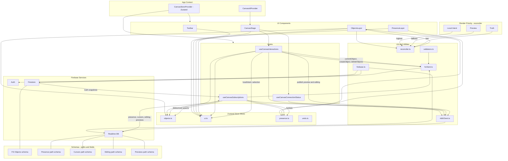

## CollabCanvas v5 — Architecture & Data Flows (Mermaid)

The diagrams below reflect the current implementation based on the code in `src/lib`, `src/store`, `src/hooks`, `src/components`, and `src/app`.

Notes
- Firestore documents parsed via `validators.ts` with Timestamp normalization.
- RTDB paths use `onDisconnect().remove()` for presence/cursors/editing/previews.
- `useCanvasSubscriptions` debounces object snapshots (~16ms) and prunes presence by TTL.
- `useCanvasInteractions` performs optimistic UI updates and transactional commits.

