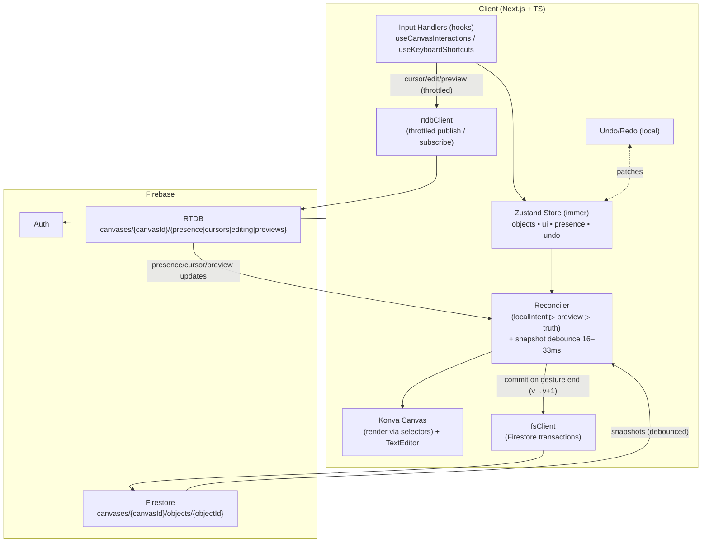

# CollabCanvas Architecture Overview Specifications

## 1) Architecture (durable truth + ephemeral signals)

* **Durable truth (Firestore):** one doc per object under `canvases/{canvasId}/objects/{objectId}`; all object changes via **per-object transaction** (`v == expectedV → v+1`).
* **Ephemeral signals (RTDB):** `presence`, `cursors`, `editing`, `previews` under `canvases/{canvasId}/…` (no object data; tiny payloads; low latency).
* **Client:** local-first via **Zustand + immer**. UI render priority: **localIntent ▷ preview ▷ truth**.
* **Text model:** edit locally; **commit on blur/Enter** (final-only, no keystroke sync).
* **Flicker control:** apply Firestore snapshots with **16–33 ms** debounce.
* **Undo/redo:** **local only**; optional persistence across reloads.

---

## 2) Technology Stack (explicit)

**Frontend**

* Next.js (App Router) + TypeScript
* Tailwind CSS + shadcn/ui
* Konva.js + react-konva
* Zustand (+ `zustand/middleware` with **immer**, optional `persist`)
* zod (runtime validation)
* nanoid (client IDs)
* lodash.throttle *(or a tiny custom throttle)*

**Firebase (Web SDK)**

* Firebase Auth (Email/Password, Google)
* Cloud Firestore (objects)
* Realtime Database (presence/cursors/editing/**previews**)

**Deployment**

* Vercel

---

## 3) Routes (App Router) — with modular hooks (no bloated pages)

```
src/app/
  (public)/
    auth/
      page.tsx           // sign up / login UI
      layout.tsx         // minimal auth shell (centered card, brand)
  (app)/
    layout.tsx           // app shell: providers (Theme, Store), auth guard/redirect
    page.tsx             // dashboard: “Create / Open Canvas”
    canvases/
      [canvasId]/
        page.tsx         // canvas screen: mounts components & wires hooks
```

**Why `layout.tsx` vs `page.tsx`?**

* `layout.tsx`: persistent frame for a route segment (providers, theming, global chrome).
* `page.tsx`: the actual screen content for that URL.

---

## 4) Directory structure (modules + hooks are explicit)

```
src/
  app/…                               // routes above
  components/
    CanvasStage.tsx                   // Konva Stage/Layers; renders via selectors
    PresenceLayer.tsx                 // cursors + names
    Toolbar.tsx
    TextEditor.tsx                    // local draft UI for text objects
  hooks/
    useCanvasInteractions.ts          // pointer gestures (move/resize/select)
    useKeyboardShortcuts.ts           // delete/duplicate/undo/redo
    useAuthGuard.ts                   // redirect unauthenticated → /auth
    useCanvasSubscriptions.ts         // wires FS & RTDB listeners for a canvas
  lib/
    firebase.ts                       // init Auth/FS/RTDB
    fsClient.ts                       // Firestore transaction helpers
    rtdbClient.ts                     // RTDB publish/subscribe (throttled)
    reconciler.ts                     // localIntent ▷ preview ▷ truth + debounce
    validators.ts                     // zod schemas
  store/
    objects.ts                        // Firestore-truth mirror (Record<objectId, CanvasObject>)
    ui.ts                             // tool, selection, draftTextById, localIntent
    presence.ts                       // RTDB mirrors
    undo.ts                           // local undo/redo (immer patches, optional persist)
    index.ts                          // create store; combine slices; devtools
```

---

## 5) Data model (canonical names)

### Firestore (durable)

`canvases/{canvasId}/objects/{objectId}`

* `id: string` *(nanoid)*
* `type: 'rect' | 'circle' | 'text'`
* `props: { x:number; y:number; w?:number; h?:number; r?:number; rotation?:number; text?:string; fill?:string }`
* `v: number` *(version, monotonic)*
* `updatedBy: string` *(uid)*
* `updatedAt: serverTimestamp()`

### RTDB (ephemeral)

`canvases/{canvasId}/presence/{userId}: { online:true, name, color, at }`
`canvases/{canvasId}/cursors/{userId}: { x, y, tool, at }`
`canvases/{canvasId}/editing/{objectId}/{userId}: { isEditing:true, at }`
`canvases/{canvasId}/previews/{objectId}: { by, x?, y?, w?, h?, rotation?, seq, at }`

---

## 6) Data flow (end-to-end)

### A) Move/Resize (multi-select supported)

1. **PointerDown** → `useCanvasInteractions`

   * Set `ui.localIntent[objectId] = { kind, propsΔ, seq:0 }` for **each selected object**.
   * RTDB: set `editing/{objectId}/{uid} = { isEditing:true }`.
2. **PointerMove** (each event)

   * Update localIntent deltas (buttery local UX).
   * **Previews publish (throttled)**: `previews/{objectId}` with `{ by, x?, y?, w?, h?, rotation?, seq:++ }` **for each selected object**.

     * Throttle policy: **80–120 ms** default; **drop to ~50 ms** when velocity is high; publish at most once per animation frame **and only if rounded props changed**.
3. **PointerUp**

   * **Firestore transaction** per object: require `v == expectedV`, merge final `props`, set `v+1`, `updatedBy/At`.
   * RTDB cleanup: remove `editing` + `previews` (also covered by `onDisconnect().remove()`).

**Peers render** with priority **localIntent ▷ preview ▷ Firestore truth**; Firestore snapshots are **debounced 16–33 ms** to avoid flicker.

### B) Text edit

* While typing: local `ui.draftTextById[objectId]` + RTDB `editing=true` (no text broadcast).
* On **Enter/blur**: Firestore transaction sets `props.text`, bumps `v`; clear `editing`.

---

## 7) Mermaid 



---

## 8) Public APIs / Interfaces (one-liners, no code)

### `lib/fsClient.ts`

* **`commitObject(canvasId, objectId, expectedV, patch, uid): Promise<void>`**
  Firestore **transaction**: check `v == expectedV`, merge `patch` into `props`, set `v+1`, `updatedBy/At`.
* **`subscribeObjects(canvasId, onSnapshot:(objs:CanvasObject[])=>void): Unsubscribe`**
  Subscribes to all object docs for the canvas; caller applies **16–33 ms** debounce.

### `lib/rtdbClient.ts`

* **`publishCursor(canvasId, data:{x:number;y:number;tool:string}): void`**
  **Throttled** RTDB `set` to `/cursors/{userId}`.
* **`publishEditing(canvasId, objectId, isEditing:boolean): void`**
  Set/remove `/editing/{objectId}/{userId}`; registers `onDisconnect().remove()`.
* **`publishPreview(canvasId, objectId, data:{x?,y?,w?,h?,rotation?,seq:number}): void`**
  **Throttled** RTDB `set` to `/previews/{objectId}` with `seq` and `at`; also registers `onDisconnect().remove()`.
* **`subscribePresence(canvasId, cb:(peersMap)=>void): Unsubscribe`**
  Streams `/presence/*`.
* **`subscribeCursors(canvasId, cb:(cursorMap)=>void): Unsubscribe`**
  Streams `/cursors/*`.
* **`subscribePreviews(canvasId, cb:(previewMap)=>void): Unsubscribe`**
  Streams `/previews/*` (ignore stale `TTL` or lower `seq`).

### `lib/reconciler.ts`

* **`applyFirestoreSnapshot(objects: CanvasObject[]): void`**
  Validate with zod; upsert into `store.objects`; apply **debounce**.
* **`selectRenderProps(objectId, state): Props`**
  Return render props using priority **localIntent ▷ preview ▷ truth**.
* **`transformIntentOnTruth(objectId, latestTruth): void`**
  If truth advanced while I’m dragging, reapply my delta on top.

### `hooks/useCanvasInteractions.ts`

* **Handles pointer down/move/up**; maintains `ui.localIntent`; calls `publishEditing`, `publishPreview`; calls `commitObject` on end.

### `hooks/useCanvasSubscriptions.ts`

* **Bootstraps canvas**: `subscribeObjects`, `subscribePresence`, `subscribeCursors`, `subscribePreviews`; syncs into Zustand slices.

### `hooks/useKeyboardShortcuts.ts`

* Wires **delete/duplicate/undo/redo** to store + `commitObject` when necessary.

### `components/TextEditor.tsx`

* Inline editor: manages `draftTextById`; **commits on Enter/blur** via `commitObject`; toggles `editing` flag.

### `store/*` slices

* **objects.ts** — `objects: Record<objectId, CanvasObject>`; `upsertMany(objs)`
* **ui.ts** — `tool`, `selectedIds`, `draftTextById`, `localIntent: Record<objectId, {kind:'move'|'resize', props:Partial<Props>, seq:number}>` + `begin/update/end`
* **presence.ts** — mirrors RTDB (`peers`, `cursors`, `editing`)
* **undo.ts** — local patches only (`undo/redo/push`)

---

## 9) Key decisions (locked)

* **Canvases** are the collaborative unit; all paths use `canvases/{canvasId}`.
* **Firestore** only for object state; **RTDB** only for signals (presence/cursor/editing/preview).
* **Text** commits on **Enter/blur** (final-only).
* **Selectors** per object to keep 60 FPS.
* **Previews** are throttled, TTL-guarded, and cleaned up with **onDisconnect().remove()**.
* **IDs** are client-chosen (`nanoid`) for stable optimistic UI.

---

## 10) Anti-patterns (project-specific)

* **Proactive diagnostics overlays/tooling**: Do not build dev-only overlays (e.g., on-canvas diagnostics panels) or telemetry hooks by default. Use browser DevTools during development. Add diagnostics/telemetry only retroactively if we hit major bugs that require extra visibility. This keeps the product/UI surface minimal and prevents accidental client/RSC boundary issues.
