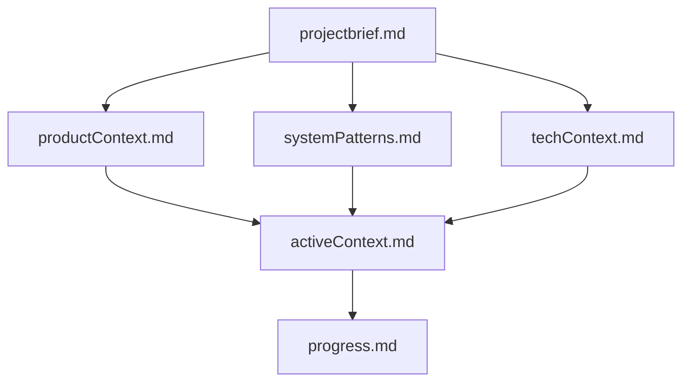

# CollabCanvas Memory Bank

This directory contains the complete memory bank for CollabCanvas - a structured knowledge base that serves as the single source of truth for understanding the project across sessions.

## Purpose

The Memory Bank is designed to enable seamless continuation of work across sessions by documenting:
- What the project is and why it exists
- How it's architected and what patterns it uses
- What technologies power it
- What's been done and what's next
- The current focus and active decisions

## File Structure

### Core Files (Read These First)

1. **`projectbrief.md`** - Foundation Document
   - Project overview and objectives
   - Core problem and solution
   - Success criteria
   - Scope boundaries
   - Key constraints
   - *Start here to understand what this project is*

2. **`productContext.md`** - Product Vision
   - Why this product exists
   - Problems it solves
   - User mental models
   - UX goals and behaviors
   - Edge case handling
   - *Read this to understand the user perspective*

3. **`systemPatterns.md`** - Architecture & Patterns
   - System architecture (Firestore + RTDB hybrid)
   - Data flow patterns
   - Component architecture
   - Key technical decisions
   - Performance patterns
   - *Read this to understand how the system works*

4. **`techContext.md`** - Technology Details
   - Complete technology stack
   - Dependencies and versions
   - Development setup
   - Technical constraints
   - Deployment architecture
   - *Read this to understand the technical foundation*

5. **`activeContext.md`** - Current State
   - Current phase and work focus
   - Recent changes
   - Next steps
   - Active decisions and open questions
   - *Read this to understand where we are now*

6. **`progress.md`** - Progress Tracker
   - What's complete
   - What's in progress
   - What's left to build
   - Known issues
   - Testing status
   - *Read this to understand what's done and what's next*

## How to Use

### Starting a New Session
1. **Always read ALL core files** (especially if you're new to the project)
2. Focus on `activeContext.md` and `progress.md` to understand current state
3. Reference `systemPatterns.md` and `techContext.md` during implementation
4. Keep `projectbrief.md` and `productContext.md` in mind for decision-making

### During Work
- Reference relevant files as needed
- Don't modify files unless you have new information or corrections
- Keep mental model aligned with documented patterns

### Updating the Memory Bank
Memory Bank updates should occur when:
- Discovering new project patterns or insights
- After implementing significant features or changes
- When user explicitly requests with "update memory bank"
- When context needs clarification or correction

When updating:
1. Review ALL files to ensure consistency
2. Update `activeContext.md` with current focus
3. Update `progress.md` with completed work
4. Update pattern/context files if architectural insights emerge
5. Never remove information unless it's incorrect

## File Dependencies

Files build on each other:
- `projectbrief.md` is the foundation
- Context files provide depth in specific areas
- `activeContext.md` synthesizes current state
- `progress.md` tracks execution

## Maintenance Guidelines

### What Belongs in Memory Bank
✅ Architectural decisions and rationale
✅ Product vision and user experience goals
✅ Current work focus and next steps
✅ Technical constraints and patterns
✅ Progress tracking and status
✅ Open questions and active considerations

### What Doesn't Belong
❌ Code snippets (belongs in codebase)
❌ Detailed API documentation (use inline docs)
❌ Task-specific implementation details (use TODO lists)
❌ Temporary debugging notes
❌ Personal preferences (use .cursor/rules/)

## Related Documentation

- `docs/prd.md` - Detailed product requirements
- `docs/architecture-overview.md` - Comprehensive architecture spec
- `docs/performance-requirements.md` - Performance rubric
- `.cursor/rules/` - Project-specific AI assistant rules

The Memory Bank distills and organizes information from these sources into a session-friendly format.

## Version History

- **v1** (Current): Initial memory bank created from project documentation
  - Distilled from PRD, Architecture Overview, and Performance Requirements
  - All 6 core files complete
  - Ready for Phase 1 implementation

---

**Remember**: The Memory Bank is your lifeline across sessions. Treat it as sacred - keep it accurate, comprehensive, and well-organized.

