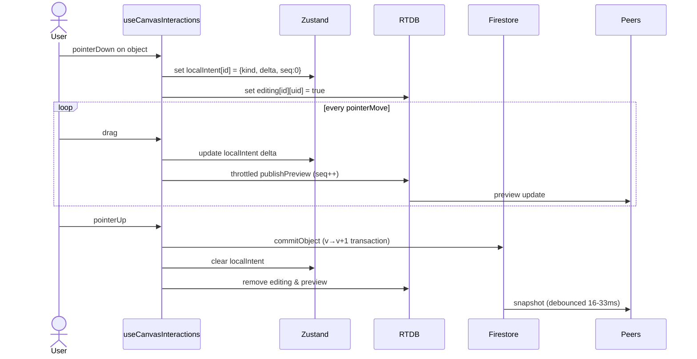
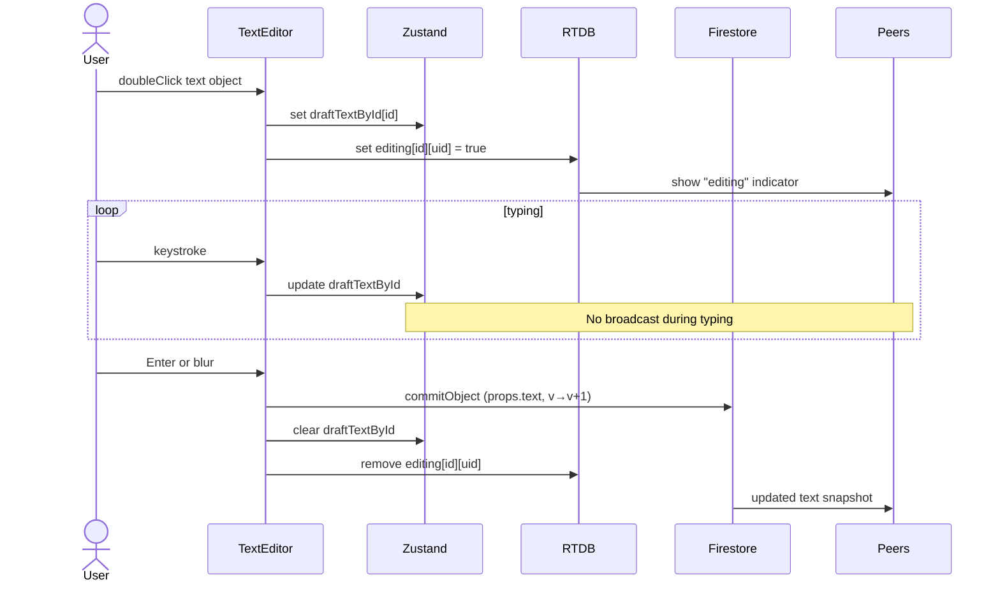
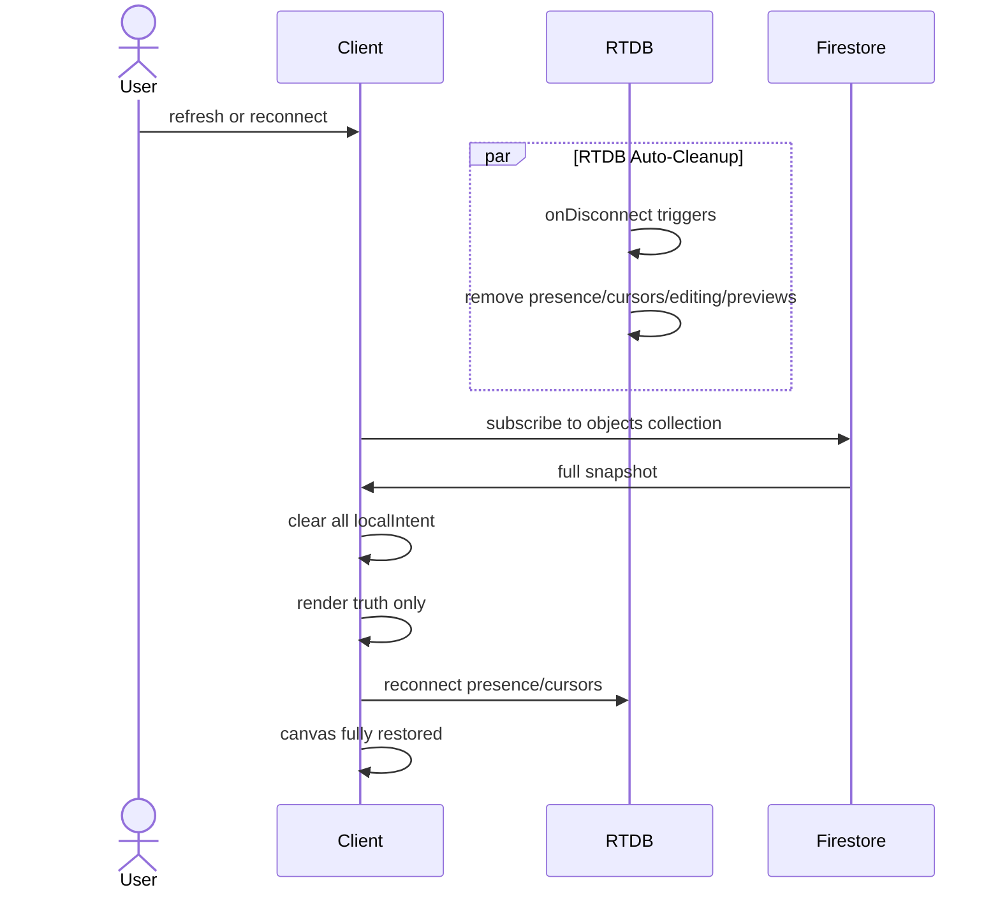

# CollabCanvas — System Patterns & Architecture

## Architectural Philosophy

### Core Pattern: Durable Truth + Ephemeral Signals
```
Firestore (slow, authoritative) ──► Object state
RTDB (fast, ephemeral) ──► Presence, cursors, previews
Zustand (instant, local) ──► Optimistic UI updates
```

### Render Priority
All object rendering follows this cascade:
```
localIntent ▷ preview ▷ truth
```
- **localIntent**: Actor's in-flight changes (instant)
- **preview**: Peer's in-flight changes from RTDB (smooth, ~80-120ms updates)
- **truth**: Firestore snapshot (debounced 16-33ms to avoid flicker)

## Data Architecture

### Firestore Schema (Durable Truth)
```
canvases/{canvasId}/objects/{objectId}
  - id: string (nanoid)
  - type: 'rect' | 'circle' | 'text'
  - props: {
      x: number
      y: number
      w?: number
      h?: number
      r?: number
      rotation?: number
      text?: string
      fill?: string
    }
  - v: number (version, monotonic)
  - updatedBy: string (uid)
  - updatedAt: serverTimestamp()
```

**Key Decisions:**
- Per-object documents for granular subscription and transaction control
- Client-chosen IDs (nanoid) for stable optimistic UI
- Version field (`v`) for optimistic concurrency control
- No nested subcollections; flat structure for simplicity

### RTDB Schema (Ephemeral Signals)
```
canvases/{canvasId}/
  presence/{userId}:
    { online: true, name: string, color: string, at: timestamp }
  
  cursors/{userId}:
    { x: number, y: number, tool: string, at: timestamp }
  
  editing/{objectId}/{userId}:
    { isEditing: true, at: timestamp }
  
  previews/{objectId}:
    { by: userId, x?: number, y?: number, w?: number, h?: number, 
      rotation?: number, seq: number, at: timestamp }
```

**Key Decisions:**
- No object data stored in RTDB; only deltas and signals
- Preview carries sequence number (`seq`) to ignore out-of-order updates
- All ephemeral paths use `onDisconnect().remove()` for automatic cleanup
- TTL enforcement on preview rendering (400-600ms)

## Component Architecture

### Directory Structure
```
src/
  app/                        # Next.js App Router
    (public)/auth/            # Public auth routes
    (app)/                    # Protected app routes
      canvases/[canvasId]/    # Canvas page
  
  components/                 # UI Components
    CanvasStage.tsx           # Konva Stage/Layers
    PresenceLayer.tsx         # Cursors + name labels
    Toolbar.tsx               # Tool selection
    layout/                   # Shared layout surfaces, fallbacks, wrappers
      AuthLoadingScreen.tsx
      AuthErrorScreen.tsx
      ProtectedAppShell.tsx
      ErrorNotice.tsx
    TextEditor.tsx            # Inline text editor
  
  hooks/                      # Reusable logic
    useCanvasInteractions.ts  # Gesture handling
    useKeyboardShortcuts.ts   # Hotkeys
    useAuthGuard.ts           # Auth protection
    useCanvasSubscriptions.ts # Firebase listeners
  
  lib/                        # Core utilities
    firebase.ts               # Firebase init
    fsClient.ts               # Firestore helpers
    rtdbClient.ts             # RTDB helpers
    reconciler.ts             # Render priority logic
    validators.ts             # Zod schemas
  
  store/                      # Zustand state
    objects.ts                # Firestore mirror
    ui.ts                     # Selection, tools, localIntent
    presence.ts               # RTDB mirrors
    undo.ts                   # Local history
    index.ts                  # Combined store
```

### Separation of Concerns

#### Pages vs Components
- **Pages (`page.tsx`)**: Minimal wiring; mount components and wire hooks
- **Components**: Pure presentation; read from store via selectors
- **Hooks**: Business logic and side effects
- **Lib**: Stateless utilities and API clients
- **Layout components**: Encapsulate loading/error UI, shells, and wrappers using shadcn primitives (no inline GSX fallbacks)

#### Why This Matters
- Pages remain lightweight and understandable
- Components are testable in isolation
- Hooks encapsulate complex interaction logic
- Store provides single source of truth

## Data Flow Patterns

### Pattern 1: Move/Resize Object(s)



### Pattern 2: Text Edit



### Pattern 3: Reconnection



## Key Technical Decisions

### Decision 1: Firestore for Objects, RTDB for Signals
**Rationale**: Firestore provides transactions and queries; RTDB provides low-latency ephemeral updates. Using both plays to their strengths.

### Decision 2: Client-Chosen Object IDs
**Rationale**: Using `nanoid` on client allows optimistic rendering without waiting for server ID assignment.

### Decision 3: Per-Object Versioning (not CRDTs)
**Rationale**: Simple last-write-wins model is predictable and sufficient for canvas use case. Avoids CRDT complexity.

### Decision 4: Final-Only Text Sync
**Rationale**: Keystroke-level text sync adds huge complexity for minimal UX gain in canvas context where text objects are short labels.

### Decision 5: Local-Only Undo/Redo
**Rationale**: Cross-user undo is confusing and complex. Local-only undo matches user mental model of "undo my actions."

### Decision 6: Debounced Firestore Snapshots
**Rationale**: 16-33ms debounce prevents flicker when rapid updates arrive while user is dragging (localIntent takes priority anyway).

### Decision 7: Throttled Preview Publishing
**Rationale**: Publishing every pointermove event would overwhelm RTDB. Throttling to 80-120ms (lower during high velocity) provides smooth previews without bandwidth abuse.

### Decision 8: Preview TTL + SEQ
**Rationale**: TTL prevents stale previews from persisting; SEQ prevents out-of-order packets from causing jitter.

### Decision 9: onDisconnect() for All Ephemeral Data
**Rationale**: Automatic cleanup prevents ghost cursors, stuck "editing" indicators, or stale previews when users disconnect ungracefully.

## Performance Patterns

### Pattern: Selective Re-rendering
- Use Zustand selectors to subscribe only to relevant slice of state
- Each Konva object component selects only its own render props
- Avoids full canvas re-render on every state change
- Shared layout surfaces (loading/error/shell) live under `components/layout` and are reused across routes. Inline fallback JSX in routes/layouts is prohibited; wrap with shadcn/ui components for consistency.

### Pattern: Reusable Fallback Surfaces (shadcn/ui)
- Never inline fallback UIs in pages or route layouts; use components under `components/layout/`
- Compose fallbacks from shadcn/ui primitives (`Card`, `Button`) for consistency

### Pattern: Canvas Stage Composition
- Use `react-konva` `Stage` + `Layer` and render children via selectors
- `CanvasStage` accepts `onStageRef`, optional `width`/`height`, and overlays a placeholder when empty
- Keep Stage-level `listening` minimized; delegate interaction to object components and hooks

### Pattern: Connection Pooling
- Single Firestore listener for entire `objects` collection
- Single RTDB listener per signal type (presence, cursors, editing, previews)
- Minimize listener overhead

### Pattern: Validation Layer
- Zod schemas validate all incoming Firestore/RTDB data
- Fail gracefully on schema violations (log error, ignore bad data)
- Prevents runtime crashes from malformed data

## Security Patterns

### Authentication
- Firebase Auth with Email/Password + Google provider
- Protected routes redirect unauthenticated users to `/auth`
- Session persistence via Firebase SDK

### Authorization
- Simple "unlisted link" model: any authenticated user can access any canvas by ID
- Future: owner-based permissions if needed
- Firestore Security Rules enforce authentication requirement

### Data Validation
- Client-side validation with Zod before writes
- Server-side validation via Firestore Security Rules
- Version checks prevent accidental overwrites

## Testing Patterns

### Unit Testing
- Test pure functions in `lib/` utilities
- Test Zustand store actions in isolation
- Mock Firebase SDK for deterministic tests

### Integration Testing
- Test hooks with mocked store
- Test components with mocked Konva
- Verify correct Firebase API calls

### E2E Testing
- Multi-browser sessions for collaborative scenarios
- Network throttling simulations
- Refresh/reconnection scenarios
- Conflict resolution scenarios

## Module Boundaries

### Principle: Unidirectional Dependencies
```
Components → Hooks → Store → Lib → Firebase
```
- Components never call lib directly
- Hooks encapsulate all store mutations
- Lib contains only stateless utilities
- Firebase is abstracted behind lib clients

### Principle: No Cross-Slice Dependencies
- Store slices are independent
- Cross-slice data access happens via composed selectors
- Prevents circular dependencies and tight coupling

## Anti-patterns (avoid)

- **Proactive diagnostics overlays/telemetry**: Do not build dev-only overlays (e.g., canvas diagnostics panels) or telemetry by default. Prefer browser DevTools. Add diagnostics **retroactively** only when needed to debug high-severity issues.

